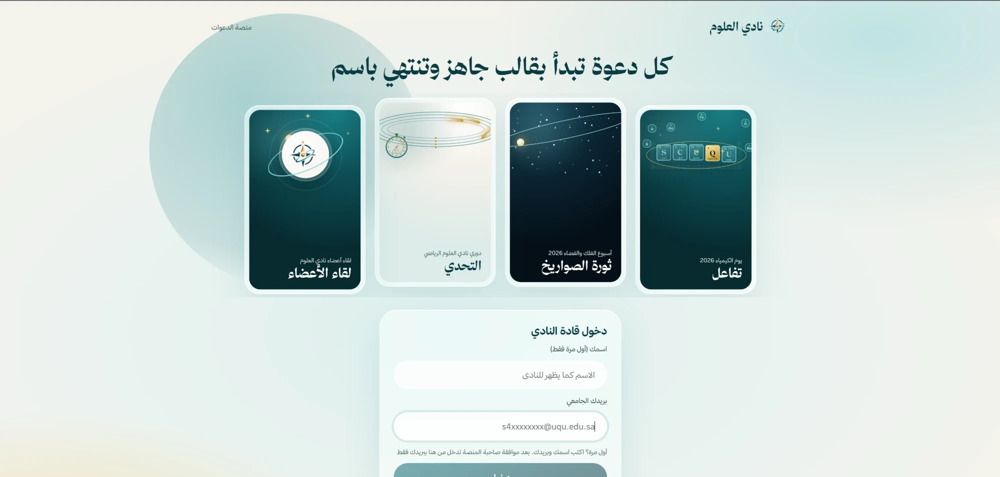
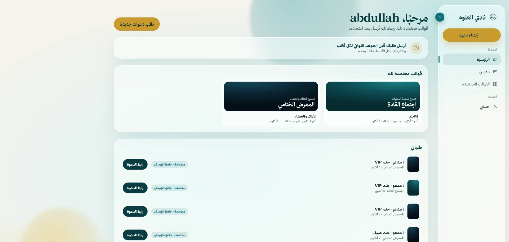
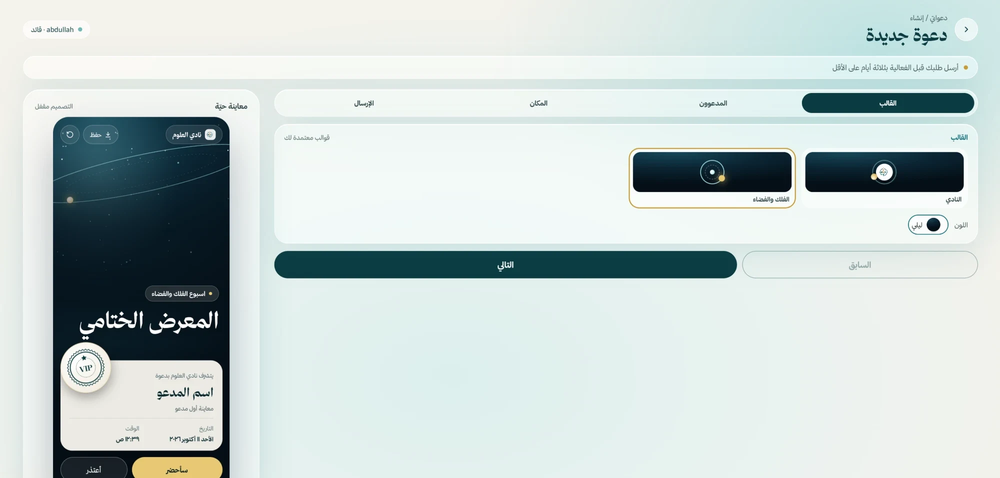
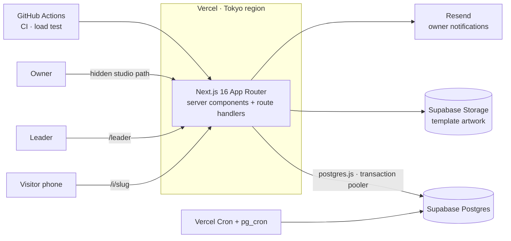
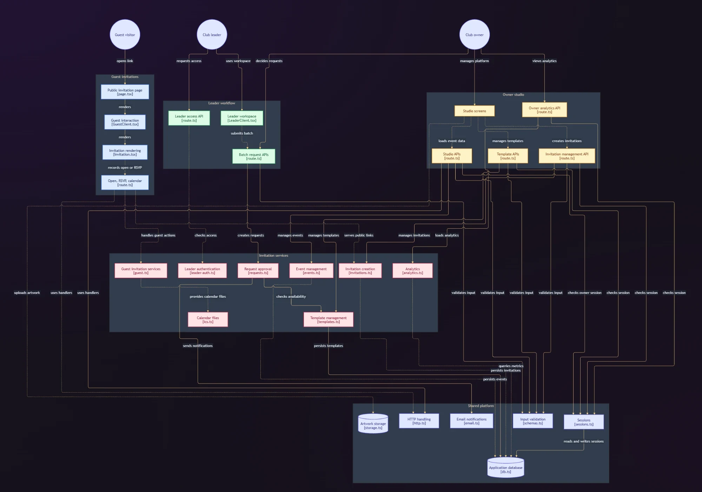
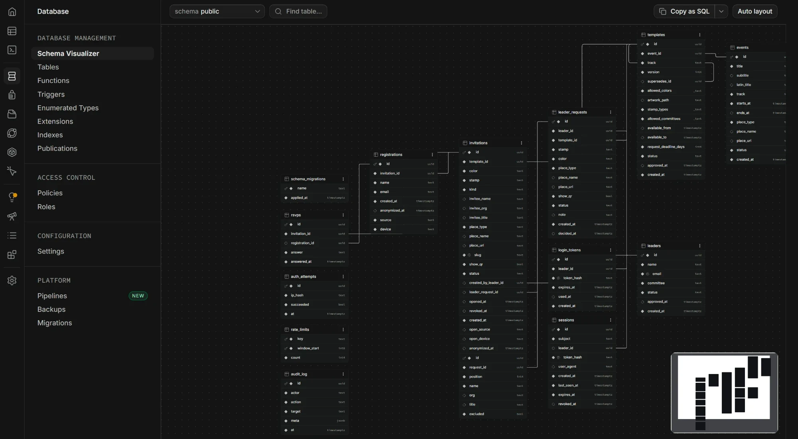

# SCinvites · منصة دعوات نادي العلوم

An Arabic (right-to-left) digital invitation platform built for the **Science Club at Umm Al-Qura University**, where it is used to invite guests, members and VIPs to club events, collect RSVPs and follow attendance live.

Built together with the club leader who owns the platform: they led the product and the visual design; I turned it into the working platform and run it (engineering, deployment, operations). The deployment is private to the club, so there is no public demo; the screenshots below use test data.



| Leader workspace | Creating an invitation (live preview) |
|---|---|
|  |  |

## What it does

**Three roles, three experiences**

| Role | What they get |
|---|---|
| **Visitor** | Opens a personal or public link on their phone: an animated invitation (one motion design per event track), their name and stamp (VIP, guest, speaker, partner, member), place with map QR code, «I'll attend / I can't» and an add-to-calendar file. Public links ask for name and email first. |
| **Club leader (admin)** | Signs in with their university email once approved, picks an approved template, adds names in bulk (or asks for a public link), sends it for approval, then shares each link by WhatsApp or copy. |
| **Owner** | A hidden studio: events, templates with versioning, invitations, an approval queue for leaders' requests, a visitor list with CSV export, live dashboard and analytics (attendance, peak hours in Riyadh time, traffic sources, semesters). |

**Built for a real launch**: hundreds of students opening the same public link within a minute, on phones, often inside WhatsApp's and Telegram's in-app browsers.

## Architecture



<details>
<summary>Full module map and database schema</summary>





</details>

- **Server-only data access**: every query runs on the server through one module; the database has row-level security on with no public policies, so the browser never talks to it directly.
- **Sessions**: random tokens stored only as SHA-256 hashes; the owner password is bcrypt-hashed; the owner area lives on a secret path and returns 404 to everyone else.
- **Data model** (15 tables): events → templates (versioned) → invitations → registrations / RSVPs; leaders → leader requests → requested people; semesters, settings, sessions, rate limits, sign-in attempts, audit log.

## Engineering highlights

- **A production freeze, traced to the wire protocol.** When two or three people used the site at once, every page started loading forever. Live diagnostics (`/api/status/db`, a fresh-connection probe and `pg_stat_activity`) showed pooled connections stuck mid-query. The cause: the Postgres driver sends parameterized queries in two round trips, and a serverless function paused between them left the transaction pooler holding the connection. Fixed at the source with a patch to the driver (one round trip for every query, verified by inspecting the messages on the wire in a test), plus a `pg_cron` reaper and a socket silence timeout as safety nets.
- **Load-tested before launch**: a GitHub Actions workflow runs 4 machines against production, simulating 400 students arriving within 60 seconds, 40 leaders and the owner approving. Result: 1,561 requests, 0 failures, p95 ≈ 500 ms. The test creates and deletes its own data.
- **Phones first**: looping animations pause after a few seconds outside the invitation page (they were keeping phone CPUs 55–85% busy), long lists are paginated, rate limits are sized for campus networks where many students share one IP, and the invitation scrolls inside in-app browsers with toolbars.
- **Privacy by default**: visitor names and emails are deleted a set number of days after each event; invitee names never appear in page titles or link previews; analytics are aggregated.
- **Tested**: 205 unit and integration tests against a real Postgres, 44 Playwright end-to-end tests on a phone viewport, type checks and lint in CI.

## Tech stack

Next.js 16 (App Router, React 19) · TypeScript · PostgreSQL 17 on Supabase (transaction pooler, `pg_cron`) · postgres.js · Vercel (Fluid compute, Cron, Web Analytics) · Resend · Zod · Vitest · Playwright · GitHub Actions.

## Run it locally

```bash
npm install
cp .env.example .env.local   # fill in OWNER_PATH and OWNER_PASSWORD_HASH (npm run hash-password -- 'a password')
npm run db:dev               # embedded Postgres on port 54329, keep it running
npm run dev
```

Tests: `npm test` · `npx playwright test` · `npm run typecheck` · `npm run lint`.

The Arabic typeface (Thmanyah) is licensed and is not included; without it the site falls back to system fonts.

---

© The code is shared for viewing as part of my portfolio. The club's name, logo and designs belong to the Science Club.
